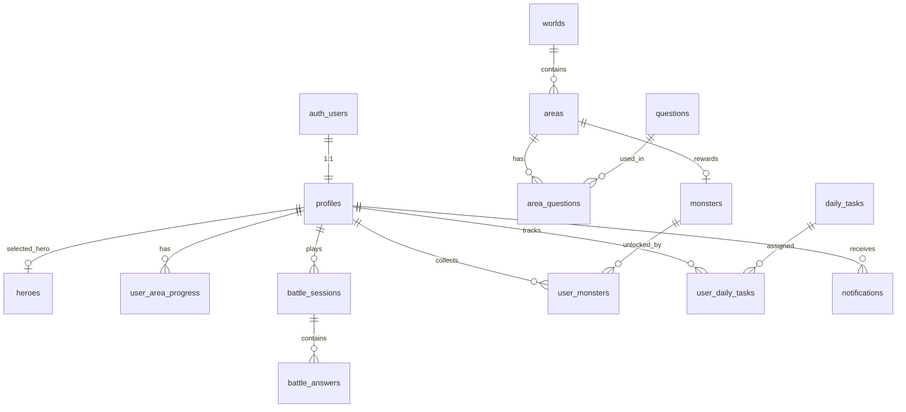

# Math Monsters — Kiến trúc Supabase

Backend cho game giáo dục toán học: auth, nhân vật, thế giới/khu vực, câu hỏi, trận đấu, sưu tập quái vật, nhiệm vụ hàng ngày, leaderboard.

## Sơ đồ tổng quan



## Luồng người dùng → Bảng dữ liệu

| Màn hình UI | Bảng / RPC chính |
|-------------|------------------|
| Đăng ký / Đăng nhập | `auth.users` → trigger `handle_new_user` → `profiles` |
| Chọn nhân vật | `heroes`, `profiles.selected_hero_id` |
| Home (thế giới, xu, level) | `worlds`, `areas`, `user_area_progress`, `profiles` |
| Chọn khu vực | `areas`, `user_area_progress` |
| Trận đấu (4 loại câu hỏi) | `questions`, `area_questions`, RPC `complete_battle` |
| Kết quả trận | `battle_sessions`, `user_area_progress`, `profiles` |
| Bộ sưu tập | `monsters`, `user_monsters` |
| Bảng xếp hạng | view `leaderboard` |
| Nhiệm vụ hàng ngày | `daily_tasks`, `user_daily_tasks`, RPC `claim_daily_task` |
| Hồ sơ / Cài đặt | `profiles`, `notification_settings`, `app_content` |

## Bảng chi tiết

### `profiles` — Hồ sơ người chơi

| Cột | Mô tả |
|-----|-------|
| `level` | Cấp độ (tự động tăng theo `total_points`) |
| `total_points` | Điểm xếp hạng (biểu tượng bóng đèn) |
| `total_coins` | Xu trong game |
| `total_stars` | Tổng sao đã thu thập |
| `selected_hero_id` | Nhân vật đang chọn |
| `dark_mode_enabled` | Chế độ tối |
| `onboarding_completed_at` | Hoàn tất onboarding (chọn hero xong) |

### `heroes` — Nhân vật chơi

Danh sách tĩnh: Thiên Định, Linh Chi, … Người chơi chọn qua `profiles.selected_hero_id`.

### `worlds` → `areas` — Thế giới & Khu vực

- **World**: Rừng Mầm Xanh, Sa Mạc Kẹo Cát, Hang Băng Lung Linh, Hẻm Núi Bánh Răng, Núi Lửa Kẹo Nóng, Trạm Sao Cầu Vồng (6 thế giới)
- **Area**: Khu vực 1, 2, 3… trong mỗi thế giới
- `order_index`: thứ tự mở khóa
- `total_questions`: số câu mỗi trận (UI: "Câu hỏi 10/10")
- `monster_id`: quái vật mở khóa khi hoàn thành

### `questions` — Ngân hàng câu hỏi

Enum `question_type`:

| Loại | JSON `content` |
|------|----------------|
| `multiple_choice` | `{ "prompt", "options", "correct_index" }` |
| `true_false` | `{ "prompt", "correct": true/false }` |
| `input` | `{ "prompt", "correct_answer" }` |
| `matching` | `{ "prompt", "pairs": [{ "left", "right" }] }` |

### `user_area_progress` — Tiến độ theo khu vực

- `stars_earned`: 0–3 sao
- `is_unlocked`: khu vực đã mở
- Chỉ khu vực 1 của **thế giới đầu tiên** tự mở khi tạo profile; hoàn thành khu cuối một thế giới → mở khu vực 1 thế giới kế tiếp

### `battle_sessions` — Lịch sử trận đấu

Ghi lại mỗi lần chơi: điểm, sao, độ chính xác, thời gian.

### `monsters` + `user_monsters` — Bộ sưu tập

Quái vật mở khóa khi hoàn thành khu vực có `monster_id`.

### `daily_tasks` + `user_daily_tasks` — Nhiệm vụ hàng ngày

| task_type | Mô tả UI |
|-----------|----------|
| `complete_matches` | "Hoàn thành 3 trận" |
| `correct_answers` | "Trả lời đúng 10 câu" |
| `collect_stars` | "Thu thập 5 sao" |

Status: `in_progress` → `completed` → `claimed`

## RPC (Edge Logic)

### `complete_battle(area_id, correct, total, duration?, score?)`

Gọi từ client sau khi kết thúc trận. Server-side xử lý:

1. Kiểm tra auth + khu vực đã mở
2. Tính sao (3★=100%, 2★≥70%, 1★=hoàn thành)
3. Ghi `battle_sessions`
4. Cập nhật `user_area_progress` (best stars/score)
5. Mở khóa khu vực tiếp theo
6. Cộng `total_points`, `total_coins`, `total_stars`, `level`
7. Mở khóa quái vật (nếu có)
8. Cập nhật tiến độ nhiệm vụ hàng ngày

```typescript
const { data } = await supabase.rpc('complete_battle', {
  p_area_id: areaId,
  p_correct_answers: 8,
  p_total_questions: 10,
  p_duration_seconds: 120,
  p_score: 12000,
})
// → { session_id, stars_earned, best_stars, points_earned, coins_earned, monster_unlocked }
```

### `claim_daily_task(user_daily_task_id)`

Nhận thưởng nhiệm vụ đã hoàn thành → cộng xu/điểm.

### `init_user_daily_tasks(user_id, date?)`

Khởi tạo nhiệm vụ ngày (tự gọi khi tạo profile và trong `complete_battle`).

## View

### `leaderboard`

Xếp hạng theo `total_points` DESC. Dùng cho tab Bảng xếp hạng.

## Storage

| Bucket | Mục đích |
|--------|----------|
| `avatars` | Ảnh đại diện user (`{user_id}/...`) |
| `game-assets` | Hero, monster, world images (public read) |

## RLS (Row Level Security)

- **Catalog** (`heroes`, `worlds`, `areas`, `questions`, …): authenticated read-only
- **User data** (`profiles`, `user_area_progress`, `battle_sessions`, …): chỉ owner
- **Leaderboard**: authenticated có thể đọc `profiles` của mọi user
- **Battle write**: qua RPC `complete_battle` (security definer), không insert trực tiếp

## Realtime (tuỳ chọn)

Bật replication cho `notifications`, `user_daily_tasks` nếu cần cập nhật live.

## Migration từ MEMORY DETOX

`schema.sql` tự DROP toàn bộ bảng cũ (`categories`, `lessons`, `quizzes`, …). **Chỉ chạy trên project mới hoặc khi chấp nhận mất dữ liệu cũ.**

## File SQL

| File | Mục đích |
|------|----------|
| `schema.sql` | Schema + RLS + triggers + RPC + storage |
| `seed.sql` | Heroes, worlds, areas, questions, daily tasks, app content |
